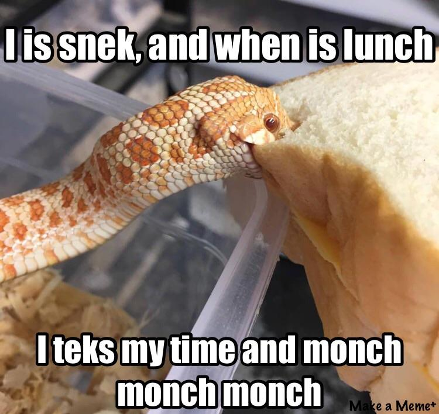
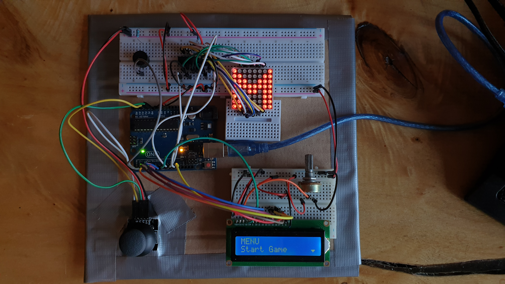

# 🐍 SNEK 🐍

 <h2>Introduction</h2> 
 

I wanted to create a more fun version of the original snake.

### Backstory:

I started playing with some game modes on the google snake game and found the one where the snake reverses when eating the fruit quite interesting. The difficulty of the project came from the limitations brought by the 8x8 matrix and it was fun trying to add features to the game without making the interface too cumbersome for the user and maintaining a good user experience.

 <h2>Game Description</h2> 
 

🐍 SNEK 🐍 is snake with a twist.

Your objective is to eat as much as possible without dying.
The original snake rules apply, but now there are also levels of difficulty. 

* <b>Difficulty 0</b> - You are just a happy snek and eat fruit.
* <b>Difficulty 1</b> - Now you are a fast boy.
* <b>Difficulty 2</b> - Now every time you eat a fruit you get confused and the end of your tail becomes your new head.
* <b>Difficulty 3</b> - Now you are both a fast and confused boy. Good luck!

Controls: 
* Use the joystick to change the direction of the snake.
* By pressing on the joystick you can pause the game.

You can select the starting difficulty from the menu and every 10 seconds the difficulty increases.

The leaderboard keeps track of all the best players, so don't forget to choose a name from the menu!

And most importantly, have fun!

 <h2>Picture</h2> 
 

 <h2>Video</h2> 
 

 <h2>Task Requirements</h2> 
 

### Menu Requirements

Create a menu for your game, emphasis on the game.  You should scroll on the LCD with the joystick.  The menu should include the following functionality:
 
* When powering up a game, a greeting message should be shown for a few moments.
* Should contain roughly the following categories:
  
  * Start game : 
    * Starts the initial level of your game.
  
  * Highscore :
    * Initially, we have 0.
    * Update  it  when  the  game  is  done.   Highest  possible  score should be achieved by starting at a higher level.
    * Save the top 5+ values in EEPROM with name and score.
  
  * Settings :
    * Enter name: The name should be shown in highscore.
    * Starting  level / Difficulty:  Set  the  starting  level / difficulty value. 
    * LCD contrast control (optional, it replaces the potentiome-ter).  Save it to eeprom.
    * LCD brightness control (mandatory, must change LED wire that’s directly connected to 5v).  Save it to eeprom.
    * Matrix brightness control (see function setIntesnity from theledControl library).  Save it to eeprom.
    * Sounds on or off.  Save it to eeprom.
    * Extra stuff can include items specific to the game mechanics or other settings such as chosen theme song etc.  Again, save it to eeprom.
    
  * About : 
    * Should include details about the creator(s) of the game. At least game name, author and github link or user.
    
  * How to play :
    * Short and informative description.

* While playing the game display relevant information regarding:  
  * Lives
  * Level
  * Score
  * Time (Optional)
  * Player name (Optional)
  
* Upon game ending: 
  * Screen 1: a message such as ”Congratulations on reaching level/scoreX”.  "You did better than y people".  etc.  Switches to screen 2 upon interaction (button press) or after a few moments.
  * Screen 2:  display relevant game info:  score, time, lives left etc. Must  inform  player  if  he/she  beat  the  highscore. This menu should only be closed by the player, pressing a button.

### Game Requirements

* Minimal components: an LCD, a joystick, a buzzer and the led matrix.
* You must add basic sounds to the game (when ”eating” food, when dying, when finishing the level etc). Extra: add theme songs.
* It must be intuitive and fun to play.
* It must make sense in the current setup. Study the idea of a panning camera - aka the 8x8 led doesn’t need to be the entire map. It can only be the current field of view of the player.
* The levels must progress dynamically. Aka the level difficulty, score and other properties should be a function of the level number or time. However, the challenge here is for it to grow in a playable way - not too easy for a long time so it becomes boring, not too hard too fast so it’s not attractive. Also, it’s nice to have an ending, a final level, a boss etc. It shouldn’t necessarily go on forever (but that’s fine, though).

 <h2>Components</h2> 
 

* Matrix (8x8)
* LCD display (16x2)
* Joystick
* Potentiometer
* Buzzer
* Resistors and wires (per logic)

